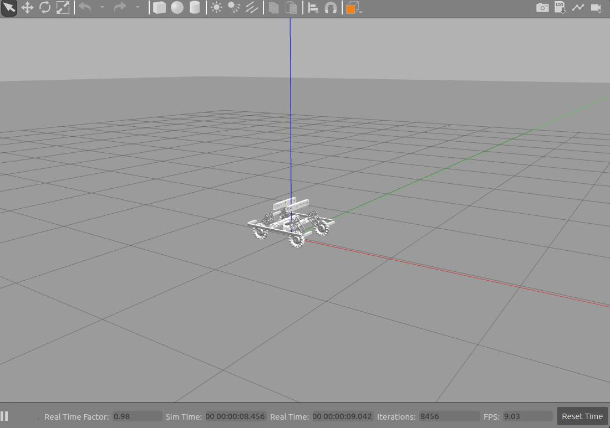

# ***Overview***

This id controller for the exam of team

Dependences:

`<depend>roscpp</depend>`
  `<depend>roslint</depend>`
  `<depend>controller_interface</depend>`
  `<depend>hardware_interface</depend>`
  `<depend>tf</depend>`
  `<depend>control_toolbox</depend>`
  `<depend>gazebo_msgs</depend>`
  `<depend>nav_msgs</depend>`
  `<depend>pluginlib</depend>`


# ***Building***

To build from source, clone the latest version from this repository into your catkin workspace and compile the package using

`cd catkin_workspace/src`

`git clone https://github.com/ZH970/hero.git`

`rosdep install --from-paths . --ignore-src`

`catkin build`

# ***Usage***

`roslaunch hero_chassis_controller hero_chassis_controller.launch`

# ***Config***

- **hero_chassis_controller.yaml**  Params of hero_chassis_controller and joint_state_controller.

# ***Code style***

C++ Google code style

Auto formating by .clang-format file

Reference:

https://google.github.io/styleguide/cppguide.html

https://github.com/kehanXue/google-style-clang-format

# ***rm_gazebo***




# ***Solution***

Accept the msg geometry_msgs from /gazebo/get_model_state

It is regarded as the speed command under the chassis coordinate system, and the desired speed of each wheel is calculated

# ***PID***

err: Difference between expected speed and actual speed

Using PID to decrease err, than add to the speed, decomposite the motor speed.


# ***pluginlib***

Plugin:   **effort_controllers_plugins** in controller_interface

**讲述插件实现流程**


## Base class
base class: 

```c++
#include <control_msgs/JointControllerState.h>
#include <control_toolbox/pid.h>
#include <controller_interface/controller.h>
#include <hardware_interface/joint_command_interface.h>
#include <memory>
#include <realtime_tools/realtime_publisher.h>
#include <ros/node_handle.h>
#include <std_msgs/Float64.h>
```


## Create the namespace

Plugin joint_velocity_controller.h:

The head file of the plugin  (namespce)


## Resign this plugin

Cpp:

Include the base and head then:

<u>**function implementation & export**</u>

```c++
PLUGINLIB_EXPORT_CLASS( effort_controllers::JointVelocityController, controller_interface::ControllerBase)
```


CMakeLists.txt:

## <u>**Declaere a C++ library**</u>

```
include_directories(include ${catkin_INCLUDE_DIRS})

add_library(${PROJECT_NAME}
  src/joint_effort_controller.cpp
  src/joint_group_effort_controller.cpp
  src/joint_group_position_controller.cpp
  src/joint_position_controller.cpp
  src/joint_velocity_controller.cpp
)
```


## Add plugin to ROS

effort_controllers_plugins.xml:

The description of this plugin.


package.xml:

```
<export>
  <controller_interface plugin="${prefix}/effort_controllers_plugins.xml"/>
</export>
```


Finally, catkin build 

## check:

`rospack plugins --attrib=plugin <plugin_name>`

or:

check the catkin_ws/devel/lib

check for **lib<plugin_name>.so** 
